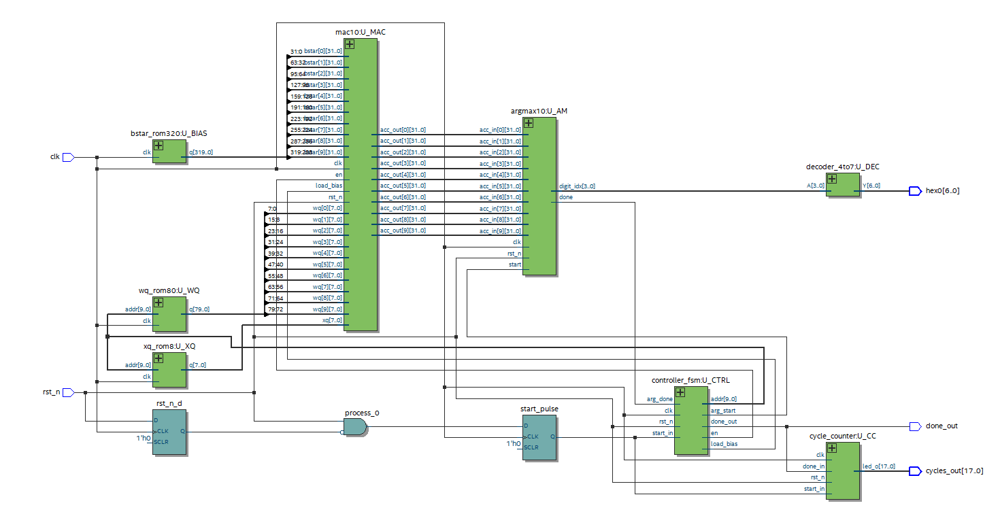

##  FPGA_FC_Inference

# 🔵 FPGA Single-Layer Neural Network Inference (VHDL)
Hardware implementation of a single-layer Fully Connected neural network on the Intel/Altera DE2-115 FPGA board.
The design performs fixed-point inference using dedicated MAC hardware, ROM-based weights, and an FSM-controlled datapath.

---

## 🧠 Project Overview

This project was developed as part of my **Bachelor’s degree final project in Electrical and Electronics Engineering**.

A single-layer Fully Connected model was **trained in Python using Google Colab** on the **MNIST digit classification dataset**. After training, the learned **weights, biases, and selected test-image pixels** were exported and converted into `.mif` memory files for FPGA use.

The FPGA implementation performs only the **inference stage**, mapping the neural computation into hardware using:

* Fixed-point arithmetic
* A custom Multiply-Accumulate (MAC) hardware block
* ROM-based weight & bias storage
* A deterministic, cycle-accurate control FSM
* RTL design in VHDL + ModelSim simulation + Quartus compilation for DE2-115

The hardware inference running on the FPGA was **compared to CPU inference running on Google Colab**, and the FPGA achieved a **~14× reduction in latency**, demonstrating the efficiency of hardware acceleration.

The project includes a full PDF report (~80 pages) detailing the architecture, implementation, results, and design trade-offs.

---

## 🔧 Key Features

* Single-layer Fully Connected neural network (FC)
* MAC hardware unit for multiply-accumulate operations
* Fixed-point quantization for efficient FPGA resource usage
* Top-level RTL architecture in VHDL
* ROM-based weight and bias loading from `.mif` files
* Control FSM managing the whole operation
* Testbenches for every major module
* Compatible with DE2-115 Cyclone IV FPGA board
* Fully synthesizable design verified with Quartus

---

## ⚙️ Applications

* Hardware acceleration
* Real-time neural inference
* Educational FPGA/ML demonstration
* Low‑latency edge AI processing
* Energy‑efficient inference for embedded systems
* Benchmarking hardware vs. software ML performance

## 📁 Repository Structure

* **packages/** – VHDL packages (types, constants)
* **rtl/** – RTL VHDL source code (MAC, ROM, FSM, top level)
* **mif/** – Memory Initialization Files (.mif) for network weights and inputs
* **tb/** – Testbenches
* **docs/** – Full project report (PDF) and architecture diagrams
* **README.md** – Project overview (this file)
* **LICENSE** – MIT License

---

## 📘 Documentation

A full project report (~80 pages) is included, containing:

* System architecture
* Neural model description and Python training workflow
* Fixed-point math
* RTL block diagrams
* MAC datapath explanation
* State machine description
* Simulation results (ModelSim)
* Synthesis + resource utilization on DE2-115
* Timing closure and hardware verification
* Latency comparison: **FPGA vs CPU (Google Colab)**

📄 **Full Report:** `docs/Project_Report.pdf`

---

## 👨‍💻 Author

**Naor David**
Electronics Engineer

